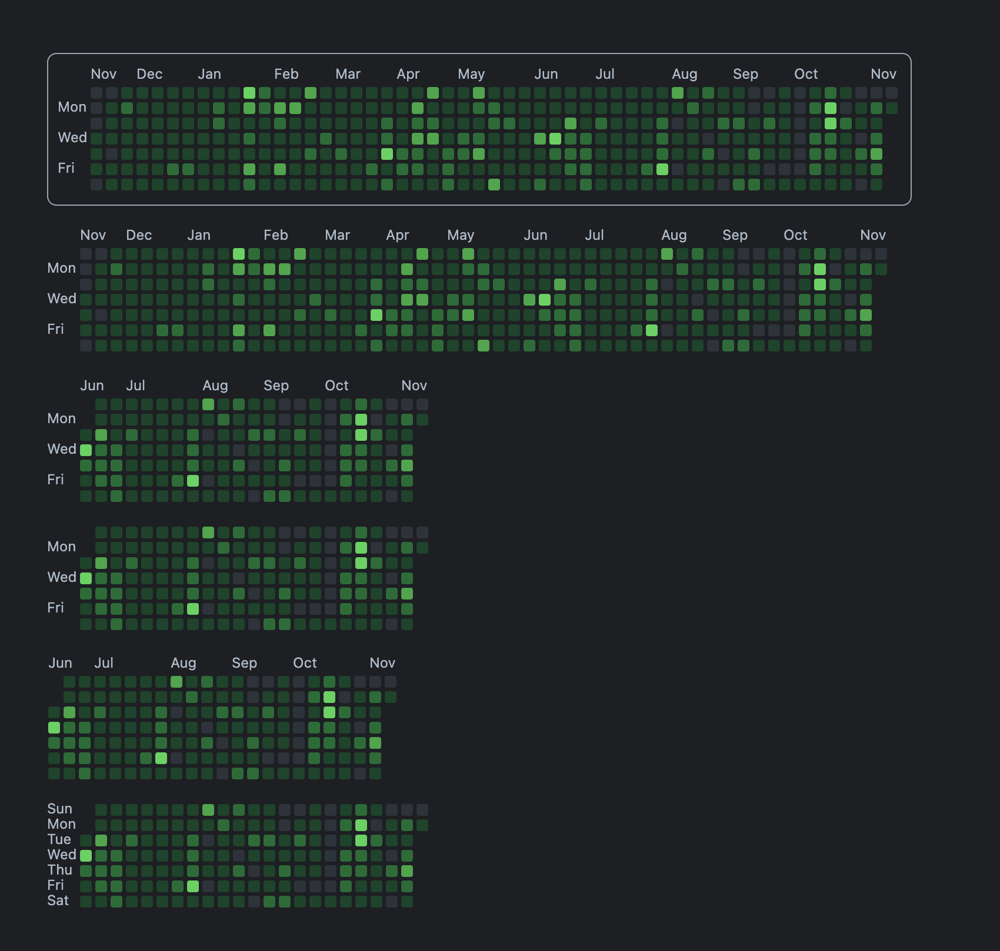

<p align="center">
    
</p>
<h1 align="center">vue3-github-calendar</h1>
<p align="center">Github activity calendar with vue3 component</p>


## Usage (Hold on, I'm releasing it soon)

```bash
npm i vue3-github-calendar
```

```vue
<template>
  <div id="app">
    <GithubCalendar :username="username" />
  </div>
</template>
```

You can see the effect first, documentation is coming soon.


